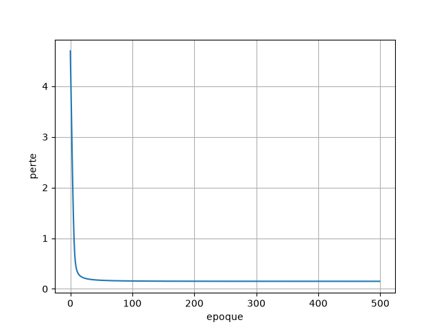
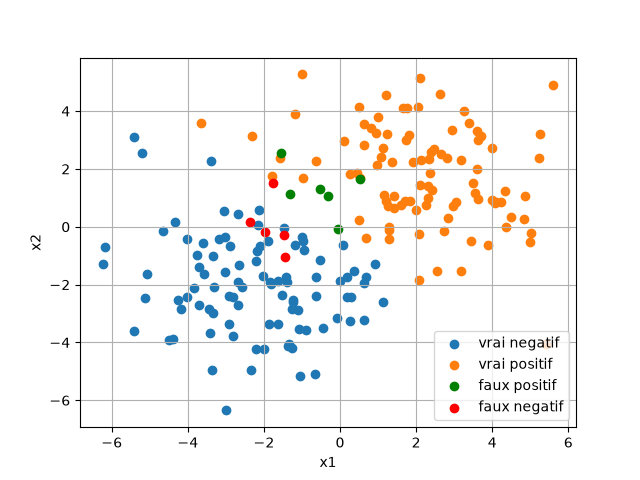
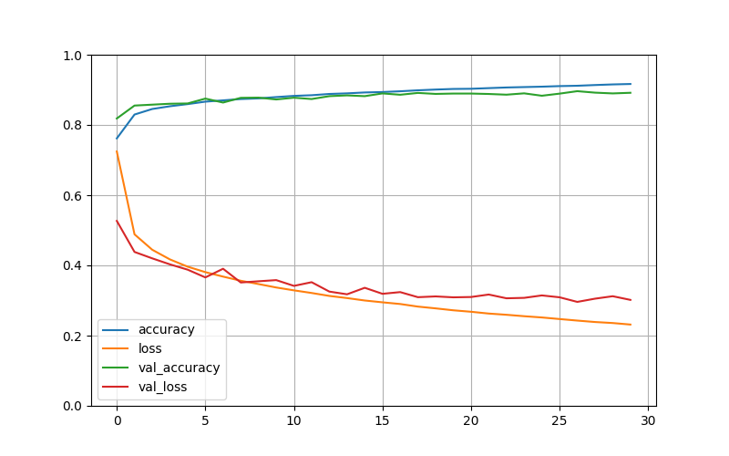

# Artificial Neuron from Scratch

A single artificial neuron written with NumPy only, trained by gradient descent to separate two clouds of points. A second part builds a multilayer perceptron with Keras on Fashion MNIST.

This was a deep learning lab at SeaTech (University of Toulon), done as a group of three.

## Part 1: one neuron, no framework

The neuron computes `z = X.w + b`, then `a = sigmoid(z)`, and learns with the log loss. I derived the gradients by hand (chain rule), then vectorized them:

```
dZ = A - Y
dW = (1/m) X^T dZ
db = (1/m) sum(dZ)
```

The `Neuron` class in `src/neuronnes/Neuron.py` implements exactly these formulas: `forward`, `loss`, `gradients`, `update`, `predict`.

`tp/neurone/train_neuron.py` generates 200 points (two Gaussian clouds centered at (-2,-2) and (2,2)), trains the neuron for 500 epochs with a learning rate of 0.1, then prints the confusion matrix and accuracy. The confusion matrix is computed with NumPy masks, without looping over points.

Loss over the epochs:



Predictions. Errors are in green (false positives) and red (false negatives):



The accuracy usually lands around 94-95%. The two clouds overlap a bit in the middle, so a straight line can't get everything right, and that's expected for a single neuron.

The seed is random on each run and printed at the start, so you can replay a run you liked.

## Part 2: MLP on Fashion MNIST

`tp/pmc/pmc.py` trains a Keras network on Fashion MNIST (10 clothing classes, 28x28 images):

- Flatten 28x28
- Dense 200, ReLU
- Dense 100, ReLU
- Dense 10, softmax

SGD with a learning rate of 0.01, 30 epochs, 5000 images kept aside for validation.



Validation accuracy ends between about 89% and 91.5% depending on the run. The model saved in this repo reaches 89.2% on validation and 88.3% on the test set. After roughly 10 epochs the validation loss stops improving while the training loss keeps going down, so the model starts overfitting. Shrinking the layers didn't beat 91.5%.

The trained model is saved in `tp/pmc/modele_fashion_mnist.keras`, and the script prints the test set accuracy at the end.

## Run it

TensorFlow doesn't support the newest Python versions yet (tested with Python 3.9 and TensorFlow 2.20). Use a virtual environment so the project doesn't depend on whatever Python is installed globally:

```bash
python -m venv .venv
.venv\Scripts\activate          # Windows
# source .venv/bin/activate     # Linux / macOS
pip install -r requirements.txt
python tp/neurone/train_neuron.py
python tp/pmc/pmc.py
```

`train_neuron.py` saves its two plots in `images/`. `pmc.py` saves the model in `tp/pmc/` and the curves in `images/`. Running it again overwrites the saved model.

## Structure

```
src/neuronnes/Neuron.py             the neuron class
tp/neurone/train_neuron.py          training on 2D points
tp/pmc/pmc.py                       Keras MLP on Fashion MNIST
tp/pmc/modele_fashion_mnist.keras   trained MLP
images/                             plots used in this README
```

## Team

Jimmy Tremouillault (math and gradient derivation), Téo Champion (code and report), Hugo Tizzian.
